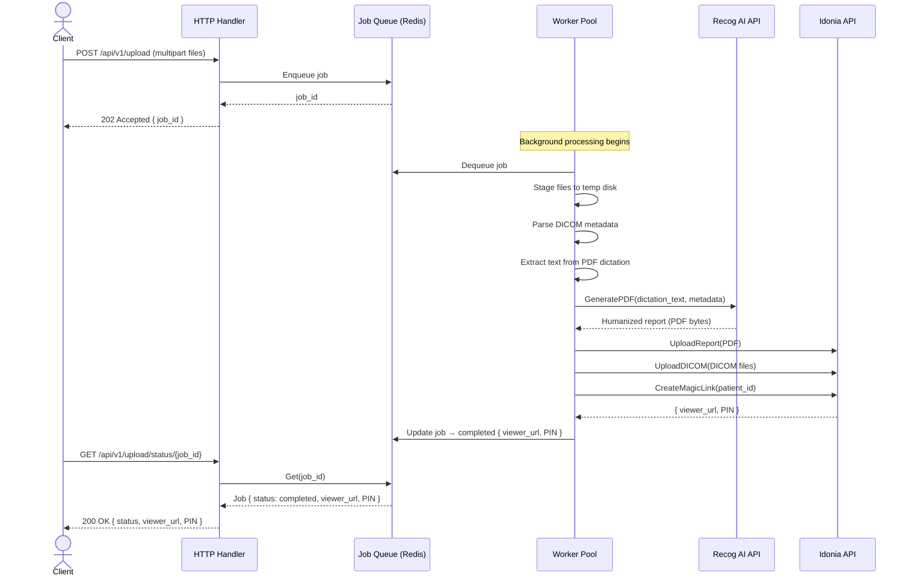

# Reto Idonia x Recog

Microservicio para resolver el problema de interoperabilidad y humanización de información médica propuesto en el I Hackathon en Biomedicina de la Sociedad Española de IA en Biomedicina.
Resuelve las tres fases propuestas:
1. Interoperabilidad
2. Humanización
3. Cero barreras

Sigue una arquitectura limpia con trabajador asíncrono para prevenir _timeouts_ en subidas de gran tamaño.

## Arquitectura

El proyecto se encuentra dividido en los siguientes paquetes:
```
.
├───cmd
│   ├───api/            # Entrada al servidor HTTP
│   └───cli/            # Entrada a la CLI
├───internal/
│   ├───clients/
│   │   ├───idonia/     # Cliente de la API de Idonia
│   │   └───recog/      # Cliente de la API de Recog
│   ├───config/         # Ajustes
│   ├───domain/         # Entidades base
│   ├───idempotency/    # Manejo de idempotencia
│   ├───logging/        # Manejo de registros (info redactada y auditoría)
│   ├───otel/           # Manejo de telemetría
│   ├───pkg/            # Funcionalidades generales
│   ├───transport/
│   │   └───http/       # Router de transporte y middlewares
│   └───usecase/        # Lógica de la aplicación
|───web/                # Mini-frontend
|
├───deployments/        # Imágenes Docker, y archivos de configuración de despliegue
|
└───ledger-explorer/    # Cliente básico para visualizar logs de tessera
```
## Características
### Requisitos
* Realiza la fase I por medio de dos interfaces
  * Cliente HTTP, que adicionalmente incluye un frontend con internacionalización
  * Cliente CLI, que puede subir archivos directamente o vigilar un directorio ante cambios
* Realiza la fase II
  * Comunicación con la API de recog aportando todo el contexto posible
  * Redacción de PII por medio del paquete `wuming` (The Nameless)
* Realiza la fase III
  * Generación de magic link
  * Es una respuesta del Worker, en lugar de dejar la conexión activa durante todo el proceso

### Rendimiento
* **Alta concurrencia nativa**: mediante goroutines, logrando paralelismo real y superando las limitaciones de bloqueo de hilo único (JavaScript) y el cuello de botella del GIL (Python).
* **Idempotencia**: implementada mediante un UUID generado durante la solicitud inicial y validado contra Redis, evitando así el re-procesamiento de solicitudes duplicadas.
* **Procesamiento paralelo**: subida de archivos a Idonia de manera paralela gracias a gorutinas
* **Arquitectura de worker**: basada en redis, que permite distribución de carga de trabajo y evita timeouts de balaceador de carga
* **Estabilidad de APIs externas**: estrategia de backoff exponencial en los clientes de Recog e Idonia por medio de avast/retry-go

### Seguridad
* **Protección de datos (PII)**: anonimización estricta al comunicarse con Recog mediante el paquete `wuming`.
* **Logs seguros**: El sistema de logging cuenta con un manejador específico que enmascara proactivamente atributos sensibles antes de escribirlos.
* **Auditoría inmutable**: El registro de auditoría incorpora árboles de hash (Merkle Trees) a través de `tessera`.
* **Telemetría integral**: permite el seguimiento preciso del flujo de negocio (`dicoms_uploaded_total`, `humanized_report_generated_total`, `magic_links_created_total`)
* **Mínima superficie de ataque**: se utiliza un binario estático compilado en Go, eliminando las vulnerabilidades de entorno asociadas a lenguajes interpretados como Python o JavaScript.
* **Imágen de docker _distroless_**: fortalecimiento de la seguridad mediante el uso de imágenes Docker distroless de solo lectura (memoria volátil), aislando el binario y los certificados HTTPS para prevenir inyecciones.
* **Validación criptográfica de archivos**: comprobación de tipo de archivo subido por lectura de bytes mágicos en lugar de extensiones de archivo, garantizando que solo se procesen formatos PDF y DICOM reales
* **Pipeline DevSecOps**: rutina de GitHub Actions con análisis de código estático (SAST) integrado usando Gosec y Trivy
* **Seguridad Frontend**: aplicación web mínima con cabeceras estrictas (expiración inmediata, no-cache, no-store), tokens CSRF, y con el PIN del reporte oculto por defecto
* **Procesamiento efímero**: el reporte PDF generado por Recog se transfiere directamente a Idonia desde la memoria RAM, sin llegar a escribirse en el disco local del servidor

### Desarrollo
* **Developer Experience (DX)**: imagen de desarrollo con recarga en caliente (hot-reload) por medio de `air`.
* **Depuración avanzada**: imagen de desarrollo configurada para debugging remoto con delve.
* **Explorador de Ledger Local**: despliegue de un explorador de auditoría interactivo que muestra los logs y verifica sus firmas (incluido como proyecto adicional en el directorio ledger-explorer, validado con la clave pública de tessera)
* **Tests Automatizados**: casos de prueba exhaustivos en Go para el orquestador (`TestOrchestrator_ProcessFiles/happy_path_with_dicom_and_pdf`, `idonia_upload_returns_500_error`, `no_pdf_found_in_batch`, `context_cancelled_during_upload`)
* **Infraestructura lista para usar**: el docker-compose de desarrollo levanta automáticamente la base de datos Redis y el servidor Prometheus

## Flujo de trabajo HTTP

El servicio utiliza un patrón de Trabajador Asíncrono en Segundo Plano (Asynchronous Background Worker). El controlador HTTP devuelve inmediatamente un job_id (HTTP 202 Accepted), mientras que un grupo de trabajadores (worker pool) procesa los archivos en segundo plano. Los clientes consultan el endpoint de estado para obtener el resultado final.



## Referencia de la API

### `POST /api/v1/upload`

Acepta un lote de archivos médicos (PDF y/o DICOM) y los pone en cola para su procesamiento asíncrono.

**Parámetros de petición**

| Propiedad           | Valor                                    |
|---------------------|------------------------------------------|
| Content-Type        | `multipart/form-data`                    |
| Campo de formulario | `files` (se permiten múltiples archivos) |

**Respuesta — `202 Accepted`**

```json
{
  "message": "Upload accepted",
  "job_id": "01J5K2M3N4P5Q6R7S8T9U0V1W2"
}
```

### `GET /api/v1/upload/status/{job_id}`

Consulta el estado de procesamiento de un trabajo enviado previamente.

**Parámetros de petición**

| Parámetro | Tipo   | Descripción                                       |
|-----------|--------|---------------------------------------------------|
| `job_id`  | string | El `job_id` devuelto por el _endpoint_ de subida. |

**Respuesta — `200 OK`**

El campo `result` solo está presente si `status` es `completed`.

```json
{
  "job_id": "01J5K2M3N4P5Q6R7S8T9U0V1W2",
  "status": "completed",
  "result": {
    "viewer_url": "https://viewer.idonia.com/share/abc123",
    "pin": "4821"
  }
}
```

**Valores que puede tomar `status`**

| Status       | Description                                                                   |
|--------------|-------------------------------------------------------------------------------|
| `pending`    | El trabajo está en cola, aún no ha sido tomado por un trabajador (_worker_).  |
| `processing` | Un trabajador está procesando los archivos activamente.                       |
| `completed`  | Procesamiento finalizado con éxito. El campo `result` contiene el Magic Link. |
| `failed`     | El procesamiento ha fracasado. El campo `error` contiene el motivo.           |


### `GET /health`

_Endpoint_ de estado de salud (_health check_). Devuelve 200 OK cuando el servicio está en ejecución. Usado para las comprobaciones de Docker y Kubernetes.

```json
{
  "status" : "ok"
}
```

### `GET /metrics`

Expone métricas en el formato estándar de Prometheus.


## Configuración

La configuración de este royecto dependende únicamente de variables de entorno. Se incluye un ejemplo de las mismas en `.env/.local.example`, que deberá copiarse y actualizar al archivo `.env/.local` para desarrollo local.

### Idonia API

| Variable               | Por defecto | Descripción                                                                                                                                    |
|------------------------|-------------|------------------------------------------------------------------------------------------------------------------------------------------------|
| `IDONIA_API_URL`       | —           | URL base de la API de Idonia.                                                                                                                  |
| `IDONIA_APIKEY`        | —           | Clave API (*API key*) para autenticarse con Idonia.                                                                                            |
| `IDONIA_SECRET`        | —           | Secreto de la API utilizado para la firma de JWT con Idonia.                                                                                   |
| `IDONIA_HACKATHON_REF` | —           | ID de referencia para el estudio del *hackathon* de Idonia. Acepta una URL completa o un ID simple — el servicio lo normaliza automáticamente. |
| `IDONIA_MAGIC_REF`     | —           | Referencia para el recurso *Magic Link* (informativo; se utiliza el valor de la respuesta de la API).                                          |

### Recog AI API

| Variable        | Por defecto | Descripción                                        |
|-----------------|-------------|----------------------------------------------------|
| `RECOG_API_URL` | —           | URL base de la API de Recog AI.                    |
| `RECOG_APIKEY`  | —           | Clave API (*API key*) para autenticarse con Recog. |

### Servidor y seguridad

| Variable   | Por defecto   | Descripción                                                                                                |
|------------|---------------|------------------------------------------------------------------------------------------------------------|
| `PORT`     | `8080`        | Puerto al que se vincula el servidor HTTP.                                                                 |
| `ENV`      | `development` | Entorno de la aplicación. Establécelo en `production` para habilitar las *cookies* seguras.                |
| `CSRF_KEY` | —             | **Exactamente 32 bytes.** Clave secreta para firmar los *tokens* CSRF.                                     |
| `HOSTS`    | —             | Lista separada por comas de orígenes CORS / nombres de host de confianza (ej., `https://app.example.com`). |

### Redis

| Variable    | Por defecto          | Descripción                                                                                                                     |
|-------------|----------------------|---------------------------------------------------------------------------------------------------------------------------------|
| `REDIS_URL` | `redis://redis:6379` | URL de conexión de Redis.                                                                                                       |
| `REDIS_TTL` | `24h`                | TTL (tiempo de vida) para claves de idempotencia y registros de trabajos. Acepta cadenas de duración de Go (ej., `12h`, `30m`). |
### Logging

| Variable          | Por defecto | Descripción                                                                                                      |
|-------------------|-------------|------------------------------------------------------------------------------------------------------------------|
| `LOG_LEVEL`       | `info`      | Severidad mínima del registro (`debug`, `info`, `warn`, `error`).                                                |
| `LOG_FORMAT`      | `json`      | Formato de salida de los registros (`json` o `text`).                                                            |
| `LOG_REDACT_KEYS` | —           | Lista separada por comas de las claves del *payload* JSON a enmascarar en los registros (ej., `password,token`). |
### Tessera Audit Log

| Variable              | Por defecto | Descripción                                                       |
|-----------------------|-------------|-------------------------------------------------------------------|
| `TESSERA_LOG_DIR`     | —           | Ruta del directorio para el registro de transparencia de Tessera. |
| `TESSERA_PRIVATE_KEY` | —           | Clave privada para firmar las entradas del registro de Tessera.   |

## Desarrollo local

### Prerequisitos

- Go 1.22+
- Docker & Docker Compose

### Ejecución

El proyecto (local, no el de producción) utiliza  [Air](https://github.com/air-verse/air) para la recarga en vivo durante el desarrollo. 
La configuración se encuentra en `.air.toml`.
Además incluye el debugger delve, que se puede conectar a los IDEs habituales.

El siguiente docker compose inicia la API con recarga en caliente (hot-reload usando Air), Redis, Prometheus y el Ledger Explorer:

```bash
docker compose -f docker-compose.local.yml up --build
```

| Servicio        | URL                   |
|-----------------|-----------------------|
| API             | http://localhost:8080 |
| Prometheus      | http://localhost:9090 |
| Ledger Explorer | http://localhost:7070 |
| Delve Debugger  | localhost:40000       |


### Ejecución de la CLI

Proceso ficheros a nivel local. Soporta los siguientes parámetros:

```
~\reto-idonia-recog > .\uploader.exe                              
A suite of tools to batch upload medical files or watch local directories for automated processing.

Usage:
  uploader [command]

Available Commands:
  completion  Generate the autocompletion script for the specified shell
  help        Help about any command
  upload      Perform a one-off upload of a specific directory
  watch       Start a background daemon to watch a directory for new files

Flags:
  -h, --help   help for uploader

Use "uploader [command] --help" for more information about a command.

```

Requiere las mismas variables de entorno que el servidor HTTP. Para construir el ejecutable:
```
go build -o uploader.exe .\cmd\cli\main.go
```

Igualmente se puede construir el ejecutable del servidor HTTP:
```
go build -o server.exe .\cmd\api\main.go  
```
pero se recomienda su despliegue por medio de Docker.


Para compilar para otras plataformas, ver la referencia oficial de `go build`.

### Ejecutar tests

```bash
go test -v ./internal/usecase/orchestrator_test.go
```